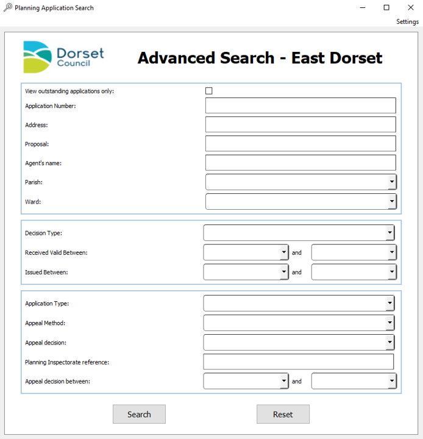

# Planning Applications Search
### Introduction
The planning application search tool is a PyQt5 based GUI that allows the user to compile results
from a search done through the GUI into a spread sheet for the data to be easily accessible. The search results
are pulled from the East Dorset planning application website (https://eastplanning.dorsetcouncil.gov.uk/).

### Documentation

#####Searching
The application attempts to mirror the online search features from the official website. For the user the search
is the same. You enter in your search parameters and click search.

##### Output
When the application has finished collecting all the results they are compiled into an excel spread sheet. By default
this output is filtered and formatted (this can be changed through the settings). The default output .xlsx document
contains three sheets; "All", "Applications" and "Decisions".

#####Settings
As of the most recent update, the settings for the application should no longer be edited directly from the
settings.json. In stead they should be change in-application through use of the "Settings" menu option. Which displays
the settings dialog.

#### Methods
The application uses the python requests library the python web scrapping library BeautifulSoup to do the majority
of the work. The results for web searches are retrieved by web scrapping and are then stored in objects 
which are they processed by regular expressions to get rid of unwanted listings.

