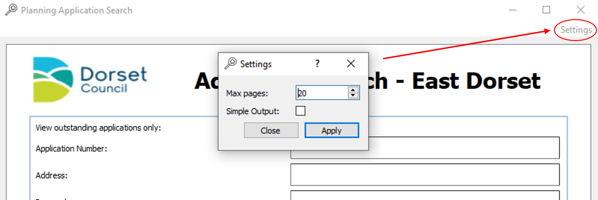

# Planning Applications Search
### Introduction
The planning application search tool is a PyQt5 based GUI that allows the user to compile results
from a search done through the GUI into a spread sheet for the data to be easily accessible. The search results
are pulled from the East Dorset planning application website (https://eastplanning.dorsetcouncil.gov.uk/).

### Documentation

##### Searching
The application attempts to mirror the online search features from the official website. For the user the search
is the same. You enter in your search parameters and click search. This starts the web scraping
and the application will collect all the results from the website.

##### Output
When the application has finished collecting all the results they are compiled into an excel spread sheet. By default
this output is filtered and formatted (this can be changed through the settings). The default output .xlsx document
contains three sheets; "All", "Applications" and "Decisions". The "All" sheet contains all the results
that the application retrieved from it's search. Some of which are not relevant. On the all page
the results that are collected and not deemed to be relevant (e.g. tree applications) are marked in red.

On the Applications and Decisions sheets, all the results that are not relevant are removed leaving on the
results which are wanted. These are split into the two sheets dependent on whether the search result
was listed with a decision and decision date.

##### Concat *(New)*
On the decisions and applications pages there is a "Concat" column which contains formatted, concatenated
data from the preceding columns. This cell also contains a hyperlink to the results page it references.

##### Settings *(New)*
As of the most recent update, the settings for the application should no longer be edited directly from the
settings.json. Instead they should be changed in-application through use of the "Settings" menu option. Which displays
the settings dialog.

##### Errors and Error Logs
If the search fails for one reason or another, the application will try to catch most of the errors
and they will be written to the errors.log file. Here more detail as to what caused the search
to fail should be listed. In the event that the application closes unexpectedly the errors.log
should also be checked as exceptions may have been caught and written to the log. The .log
file also contains the request parameters to that the failed request can be recreated and fixed.

### Methods
The application uses the python requests library the python web scrapping library BeautifulSoup to do the majority
of the work. The results for web searches are retrieved by web scrapping and are then stored in objects 
which are they processed by regular expressions to get rid of unwanted listings.

